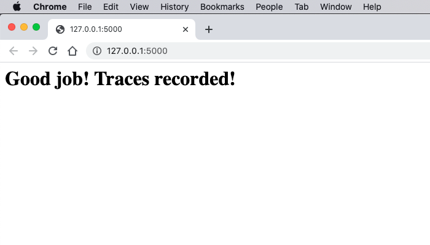
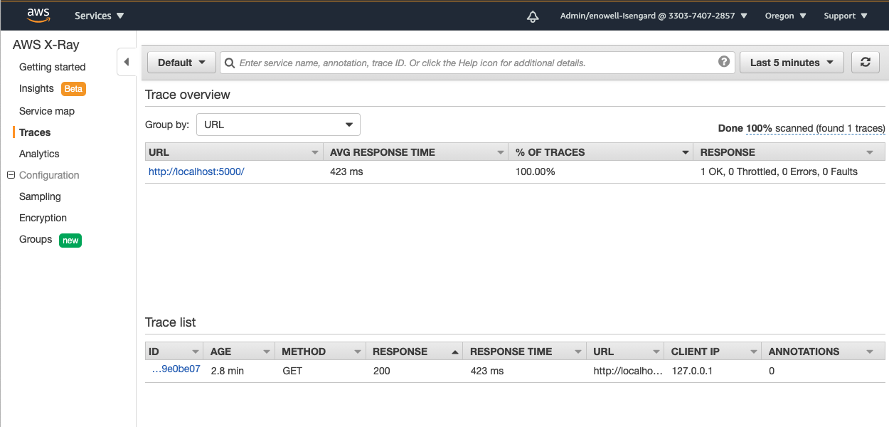
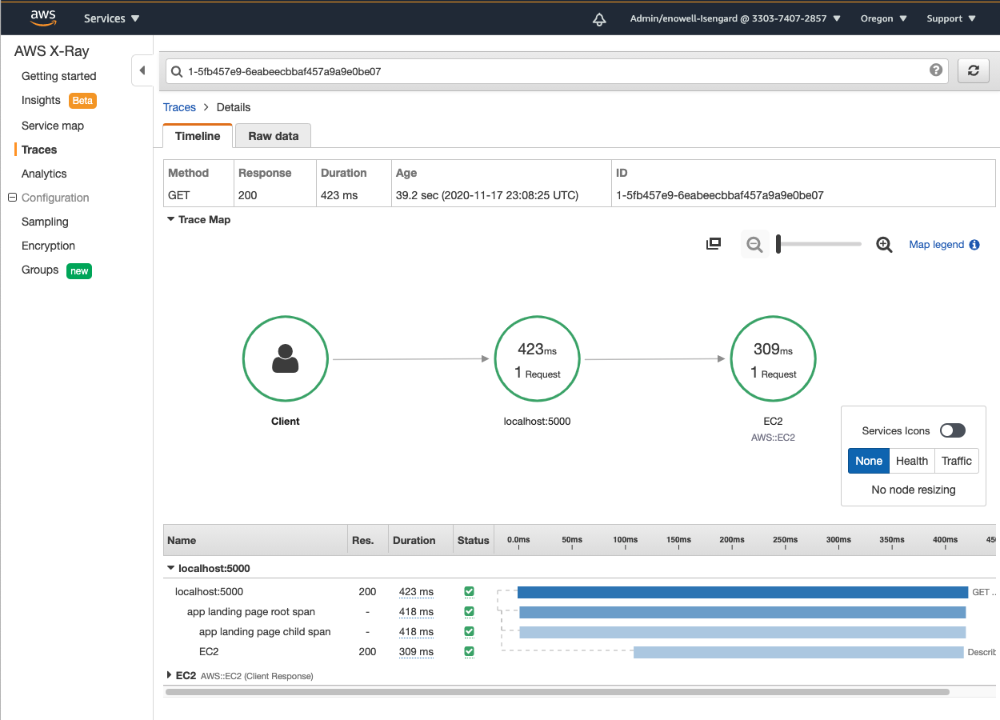

# AWS OTel Python Distribution

AWS OpenTelemetry for Python (AWS OTel for Python) is a distribution of OpenTelemetry for Python (OTel Python) configured to trace applications in a format compatible with AWS X-Ray service. This way, all the features of the OpenTelemetry project are available, but its components are configured to create traces which can be viewed in the AWS X-Ray console and are configured to allow propagation of those contexts across multiple downstream AWS services.

## How It Works

OpenTelemetry, a project maintained by the Cloud Native Computing Foundation, provides open source APIs, libraries, and agents to collect distributed traces and metrics for application monitoring.

Including OpenTelemetry in a project allows manual tracing for tasks the application undertakes. In addition, OpenTelemetry for Python provides automatic tracing for many popular Python packages. These traces record parameters used, results, exceptions, and more in the span _attributes_ as it completes the traced task. Read more about standardized attributes on the OpenTelemetry Specification [Semantic Conventions for traces](https://github.com/open-telemetry/opentelemetry-specification/tree/master/specification/trace/semantic_conventions).

Once traces have been generated, they can be sent to a backend service like AWS X-Ray to display the traces in a user-friendly interactive console packed with features to visualize and understand exactly what happened during traced calls. Learn more about the AWS X-Ray backend service [here](https://docs.aws.amazon.com/xray/latest/devguide/aws-xray.html).

An easy way for a traced application to send traces to AWS X-Ray is by using the OpenTelemetry Collector. The traced application configures OpenTelemetry for Python to export traces in the OpenTelemetry Format and subsequently directs the traces to a Docker Container running the OpenTelemetry Collector. The OpenTelemetry Collector is configured with [AWS credentials for the cli](https://docs.aws.amazon.com/cli/latest/userguide/cli-configure-files.html), the region, and which trace attributes to index so that it can send the traces to the AWS X-Ray console. Read more about the OpenTelemetry Collector [exporter for AWS X-Ray](https://github.com/open-telemetry/opentelemetry-collector-contrib/tree/master/exporter/awsxrayexporter).

## Getting Started

Go through the following steps to get started with AWS OTel for Python and see traces of an application show up in AWS X-Ray. This guide walks through the setup of an example application. Begin by creating a folder for the application (e.g. `mkdir aws-otel-python-demo-app/`).

### Setup The OpenTelemetry Collector

Follow these steps to configure the OpenTelemetry Collector for use with the AWS X-Ray backend service and get it running and ready to receive and export races.

#### Steps

1. Download Golang [here](https://golang.org/doc/install). Verify the install was successful.

```
$ go version
go version go1.15.2 darwin/amd64
```

2. Download Docker on the local machine [here](https://docs.docker.com/get-docker/). Verify the install was successful.

```
$ docker version
Client: Docker Engine - Community
 Cloud integration: 1.0.1
 Version:           19.03.13
. . .
```

3. In a directory for all OTel Collector files (e.g. `aws-otel-python-demo-app/docker/`), create a `collector-compose.yml` file and add the configuration below. Read more about the configuration in the file comments.

```
# YAML to configure the OpenTelemetry Collector

# List the format and source address from which it will accept incoming requests
receivers:
  # Accepts traces in the otlp format
  otlp:
    protocols:
      grpc:
        # Accepts traces at port 55798 from any IP address 0.0.0.0
        endpoint: 0.0.0.0:55678

exporters:
  # Sends traces to AWS X-Ray automatically using the integrated awsxray
  # exporter
  awsxray/custom_name:
    # The AWS region to send traces to
    region: us-west-2
    # If a trace includes one of these attributes, make it index-able in AWS
    # X-Ray. Optionally, use `index_all_attributes: true` to make all attributes
    # index-able.
    indexed_attributes: ["annotation.color"]
  # Send logs including information about sent traces to the console output
  logging:
    # Log at the debug level
    loglevel: debug

# The included processors to use when exporting the traces
processors:
  # Send the traces in batches as opposed to immediately upon receipt
  batch:
  # If a trace fails, queue it and retry
  queued_retry:

# The entry point for the collector
service:
  pipelines:
    # Configure the pipeline used to handle traces sent to the OTel Collector
    # from receipt to process to export
    traces:
      receivers: [otlp]
      processors: [batch, queued_retry]
      exporters: [awsxray/custom_name, logging]

```

4. For this demonstration, AWS credentials and configurations are needed to communicate with the AWS X-Ray service. Determine the `ACCESS_KEY_ID` and `SECRET_ACCESS_KEY` and make sure they are either in the `~/.aws/credentials` config file or that they are known and can be set in environment variables in a following step. Find out more information [here](https://docs.aws.amazon.com/cli/latest/userguide/cli-configure-files.html).

5. In the same `aws-otel-python-demo-app/docker` folder, create a `docker-compose.yml` file

```
# YAML to run a Docker container with a configured OTel Collector

version: "2"
services:
  collector:
    # Pull the OTel Collector image from the Docker Registry
    image: otel/opentelemetry-collector-contrib-dev:latest
    # Tell OTel Collector where to find its configuration and what log level to
    # use
    command: ["--config=/conf/collector-config.yaml", "--log-level=DEBUG"]
    volumes:
      # Load the configuration for the OTel collector into the Docker container
      - ./collector-config.yaml:/conf/collector-config.yaml
      # If not using env variables, load AWS credentials on the local machine
      # onto the Docker container
      - ~/.aws/credentials:/.aws/credentials
    # If not mounting the AWS credentials through the `~/.aws/credentials` use
    # these environment variables.
    # environment:
    #   AWS_ACCESS_KEY_ID: <AWS_ACCESS_KEY_ID>
    #   AWS_SECRET_ACCESS_KEY: <AWS_SECRET_ACCESS_KEY>
    # The HOST:CONTAINER ports to use to run the Docker Container
    ports:
      - "55678:55678"
```

6. In a _new_ terminal window and in the directory with the `docker-compose.yaml` file, start the docker image using `docker-compose pull && docker-compose up --remove-orphans`. (Add the `-d` flag to run it in the background, and use `docker-compose stop` to stop the container.)

### Setup The OpenTelemetry Python SDK

In this demo, a basic flask app `aws-otel-python-demo-app/my_flask_app.py` is created. Follow the steps below to build an app ready to send traces to AWS X-Ray using OTel Python SDK.

#### Basic Requirements

1. Ensure Python 3+ is installed (a requirement for using OTel for Python)

```
$ python3 -V
Python 3.8.6
```

2. Install the following packages from OTel Python using pip. The install was successful if the following commands run without any errors

```
$ pip install opentelemetry-api==0.16b1 \
              opentelemetry-sdk==0.16b1 \
              opentelemetry-exporter-otlp==0.16b1 \
              opentelemetry-sdk-extension-aws==0.16b1
$ python3 -c "exec(\"import opentelemetry\nimport opentelemetry.sdk\nimport opentelemetry.exporter.otlp\nimport opentelemetry.sdk.extension.aws\")"
```

3. In `aws-otel-python-demo-app/my_flask_app.py`, add imports for packages the application will use

```
import boto3
from flask import Flask
import json
```

4. Add imports for OTel components into the application

```
from opentelemetry import trace
from opentelemetry.exporter.otlp.trace_exporter import OTLPSpanExporter
from opentelemetry.trace import SpanKind

from opentelemetry.sdk.trace import TracerProvider
from opentelemetry.sdk.trace.export import BatchExportSpanProcessor
```

#### Install Instrumentation Packages

OTel Python distributes many packages which provide automatic instrumentation for well-known Python packages. They can be installed manually or automatically.

##### Manually

1. Install packages used in this application manually using pip

```
pip install opentelemetry-instrumentation-flask==0.16b1
pip install opentelemetry-instrumentation-botocore==0.16b1
```

##### Automatically

1. Download the OTel Python instrumentation package using pip

```
pip install opentelemetry-instrumentation==0.16b1
```

2. To detect and install all packages used in the application, go to the directory of the application which currently imports these packages and run the following command

```
opentelemetry-bootstrap --action=install
```

#### Tracing A Basic Flask Application for AWS X-Ray

1. Add AWS X-Ray for OTel Python components as imports into the application

```
from opentelemetry.sdk.extension.aws.trace import AwsXRayIdsGenerator
```

2. Configure the Global Tracer Provider to export to the Docker Container running the OTel Collector locally

```
# Sends generated traces in the OTLP format to a OTel Collector running on port 55678
otlp_exporter = OTLPSpanExporter(endpoint="localhost:55678", insecure=True)
# Processes traces in batches as opposed to immediately one after the other
span_processor = BatchExportSpanProcessor(otlp_exporter)
# Configures the Global Tracer Provider
trace.set_tracer_provider(TracerProvider(active_span_processor=span_processor, ids_generator=AwsXRayIdsGenerator()))
```

3. Create components used by the application. In this case a Flask app is created.

```
app = Flask(__name__)
```

##### Instrumenting Packages

Packages can either be manually instrumented by importing specific Instrumentor classes, or automatically using [the auto-instrumentation package distributed by OTel Python Core](https://github.com/open-telemetry/opentelemetry-python/tree/master/opentelemetry-instrumentation) which will instrument all packages for which there is an installed instrumentation package for.

###### Manually

1. Add imports for Instrumentors in OTel Python instrumentation packages

```
from opentelemetry.instrumentation.botocore import BotocoreInstrumentor
from opentelemetry.instrumentation.flask import FlaskInstrumentor
```

2. Initialize the Instrumentors for each package that is to be automatically traced. Pay attention to the Instrumentor initialization requirements.

```
BotocoreInstrumentor().instrument()
FlaskInstrumentor().instrument_app(app)
```

###### Automatically

No code is needed, Instrumentors are automatically initialized if using the `opentelemetry-instrument` executable as described in later steps.

##### Setting the Global Propagators

To allow Span context to propagate downstream when the application makes calls to external services, configure the global propagator to use the included AWS X-Ray Format Propagator.

```
from opentelemetry import propagators
from opentelemetry.sdk.extension.aws.trace.propagation.aws_xray_format import AwsXRayFormat

propagators.set_global_textmap(AwsXRayFormat())
```

Alternatively, the `OTEL_PROPAGATORS` environment variable can be set before the application is run to have OTel Python automatically find and use the AWS Propagator.

```
OTEL_PROPAGATORS=aws_xray
```

#### Tracing Application Tasks

1. Get a tracer from the Global Tracer Provider

```
tracer = trace.get_tracer(__name__)
```

2. Start a root span in the code path that is to be traced and add nested traces as desired.

```
@app.route('/')
def hello_world():
    with tracer.start_as_current_span("app landing page root span"):
        print('Finished a root span')
        with tracer.start_span("app landing page child span"):
            ec2_client = boto3.client('ec2')
            result = ec2_client.describe_instances()
            print('EC2 Describe Instances: ', json.dumps(result, default=str, indent=4))
            print('Finished a child span')
            return '<h1>Good job! Traces recorded!</h1>'
```

#### Putting it all together

Once all code has been added, `aws-otel-python-demo-app/my_flask_app.py` should look like the following depending on whether Manual or Automatic Instrumenting instructions were followed.

##### Manually Traced App

```
import boto3
from flask import Flask
import json

from opentelemetry import trace
from opentelemetry import propagators
from opentelemetry.exporter.otlp.trace_exporter import OTLPSpanExporter
from opentelemetry.trace import SpanKind

from opentelemetry.sdk.trace import TracerProvider
from opentelemetry.sdk.trace.export import BatchExportSpanProcessor

from opentelemetry.sdk.extension.aws.trace import AwsXRayIdsGenerator

# Sends generated traces in the OTLP format to a OTel Collector running on port 55678
otlp_exporter = OTLPSpanExporter(endpoint="localhost:55678", insecure=True)
# Processes traces in batches as opposed to immediately one after the other
span_processor = BatchExportSpanProcessor(otlp_exporter)
# Configures the Global Tracer Provider
trace.set_tracer_provider(TracerProvider(active_span_processor=span_processor, ids_generator=AwsXRayIdsGenerator()))

app = Flask(__name__)

from opentelemetry.instrumentation.botocore import BotocoreInstrumentor
from opentelemetry.instrumentation.flask import FlaskInstrumentor

BotocoreInstrumentor().instrument()
FlaskInstrumentor().instrument_app(app)

from opentelemetry import propagators
from opentelemetry.sdk.extension.aws.trace.propagation.aws_xray_format import AwsXRayFormat

propagators.set_global_textmap(AwsXRayFormat())
tracer = trace.get_tracer(__name__)

@app.route('/')
def hello_world():
    with tracer.start_as_current_span("app landing page root span"):
        print('Finished a root span')
        with tracer.start_span("app landing page child span"):
            ec2_client = boto3.client('ec2')
            result = ec2_client.describe_instances()
            print('EC2 Describe Instances: ', json.dumps(result, default=str, indent=4))
            print('Finished a child span')
            return '<h1>Good job! Traces recorded!</h1>'
```

##### Automatically Traced App

```
import boto3
from flask import Flask
import json

from opentelemetry import trace
from opentelemetry import propagators
from opentelemetry.exporter.otlp.trace_exporter import OTLPSpanExporter
from opentelemetry.trace import SpanKind

from opentelemetry.sdk.trace import TracerProvider
from opentelemetry.sdk.trace.export import BatchExportSpanProcessor

from opentelemetry.sdk.extension.aws.trace import AwsXRayIdsGenerator

# Sends generated traces in the OTLP format to a OTel Collector running on port 55678
otlp_exporter = OTLPSpanExporter(endpoint="localhost:55678", insecure=True)
# Processes traces in batches as opposed to immediately one after the other
span_processor = BatchExportSpanProcessor(otlp_exporter)
# Configures the Global Tracer Provider
trace.set_tracer_provider(TracerProvider(active_span_processor=span_processor, ids_generator=AwsXRayIdsGenerator()))

app = Flask(__name__)

from opentelemetry import propagators
from opentelemetry.sdk.extension.aws.trace.propagation.aws_xray_format import AwsXRayFormat

propagators.set_global_textmap(AwsXRayFormat())
tracer = trace.get_tracer(__name__)

@app.route('/')
def hello_world():
    with tracer.start_as_current_span("app landing page root span"):
        print('Finished a root span')
        with tracer.start_span("app landing page child span"):
            ec2_client = boto3.client('ec2')
            result = ec2_client.describe_instances()
            print('EC2 Describe Instances: ', json.dumps(result, default=str, indent=4))
            print('Finished a child span')
            return '<h1>Good job! Traces recorded!</h1>'
```

### Setup AWS X-Ray

1. Confirm that it is possible access the AWS X-Ray console (e.g. https://us-west-2.console.aws.amazon.com/xray/home) using the account associated with the AWS credentials used in previous steps. If an error message appears please contact your AWS system administrators.

### Send Traces From an Application to AWS X-Ray

In this section, start the Flask application and notice how calls to code paths covered by tracing generate traces that appear in AWS X-Ray.

#### Run the Application

In a new terminal window, move to the project directory (`cd aws-otel-python-demo-app/`) and start the application with either manual or automatic instrumentation.

##### Manual Instrumentation

1. Start the traced application ensuring that the following environment variables are
set.

```
FLASK_APP=./my_flask_app.py; flask run
```

##### Automatic Instrumentation

1. Start the traced application ensuring that the following environment variables are
set

```
FLASK_APP=./my_flask_app.py; opentelemetry-instrument -e otlp --ids-generator aws_xray flask run
```

#### View Traces in AWS X-Ray

1. In a web browser, navigate to `localhost:5000` to hit the traced code path of the application



2. Go to the X-Ray service in AWS and view traces for the traced application. Ensure the console is configured to show traces for the correct region (e.g. `us-west-2`) and over the last few minutes (e.g. "Last 5 Minutes").

In the sidebar, go to the `Traces` tab to view all traces over a period.


Click on the trace, and view the service map showing the traces across services.


## Automatic Instrumentation Focus

This section explains how to quickly start using auto instrumentation to trace an ppliaction with OTel Python.

In order to automatically instrument an application using OpenTelemetry for Python (OTel for Python) for tracing with AWS X-Ray, the following minimum steps can be taken:

1. Download the instrumentation package:

```
pip install opentelemetry-instrumentation==0.16b1
```

This will automatically install the `opentelemetry-api` and `opentelemetry-sdk`
packages.

2. Install the AWS X-Ray OTel SDK extension package to obtain the necessary
configuration components for the OTel SDK.

```
pip install opentelemetry-sdk-extension-aws==0.16b1
```

3. In the directory of the application, run the following command to
automatically detect and install all instrumentation packages distributed by
OTel Python.

```
opentelemetry-bootstrap --action=install
```

4. Run the `opentelemetry-instrument` command with the `--ids-generator aws_xray` configuration to wrap the application with instrumentation automatically and to automatically make traces compatible with AWS X-Ray.

```
opentelemetry-instrument --ids-generator aws_xray python3 ./path/to/python/application.py
```

### Simple Example

As an example, auto instrumentation can be configured to use the OTLP exporter and uses environment variables to know where to send the exported traces. Auto instrumentation is told to execute the `flask` module with the command `run` and environment variables to configure the Flask App execution.

#### Steps

1. To set up the OTLP exporter, view the section [Setup The OpenTelemetry Collector](README.md#setup-the-opentelemetry-collector) above.

2. In the example, the OTLP Exporter is used, and must be installed separately. Install and verify the installation with the following commands:

```
pip install opentelemetry-exporter-otlp==0.16b1
$ python3 -c "exec(\"import from opentelemetry.exporter.otlp.trace_exporter\")"
```

3. Create a simple Flask App `./my_flask_app.py` as follows:

```
import requests

from flask import Flask

app = Flask(__name__)

@app.route('/')
def traced_route_method():
    return '<h1>Root Route request was traced!</h1>'

@app.route('/make_a_request')
def traced_route_method():
    requests.get('https://aws.amazon.com')
    return '<h1>Request was traced!</h1>'
```

4. Auto instrument it with `opentelemety-instrument` as so

```
OTEL_EXPORTER_OTLP_ENDPOINT="localhost:55678"; OTEL_EXPORTER_OTLP_INSECURE=True; FLASK_APP=./my_flask_app.py; opentelemetry-instrument -e otlp --ids-generator aws_xray flask run
```


5. Navigate to http://localhost:5000 and http://localhost:5000/make_a_request to create traces that can be seen in the AWS X-Ray console.

## Links

Find out more about AWS X-Ray Tracing with Opentelemetry for Python at the
following links.

### OpenTelemetry for Python

- [OpenTelemetry for Python Core GitHub](https://github.com/open-telemetry/opentelemetry-python)
- [OpenTelemetry for Python Contrib GitHub](https://github.com/open-telemetry/opentelemetry-python-contrib)
- [AWS Distro for OpenTelemetry](https://aws-otel.github.io/)


## Security

See [CONTRIBUTING](CONTRIBUTING.md#security-issue-notifications) for more information.

## License

This project is licensed under the Apache-2.0 License.
